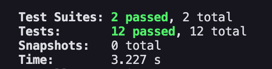
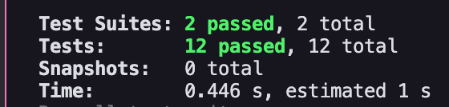

### POC

Analyse speeds using ts-jest vs swc/jest


| | |
|:---:|:---:|
| ts-jest | swc/jest |

### How to run swc/jest

```
npx jest
```

## How to test ts-jest

if you want to test with ts-jest change jest.config.js to

```js
/** @type {import('ts-jest').JestConfigWithTsJest} */
module.exports = {
  preset: 'ts-jest',
  testEnvironment: 'node',
};
```